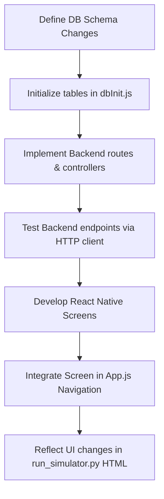

# Developer Workflows - Elim Cebimde

This document outlines the workflows for developing, running, testing, and modifying the **Elim Cebimde** financial discipline system.

---

## 1. Startup Workflows

### Simulator Startup
1. Ensure no other service holds port `8700`.
2. Boot the standalone Python simulator from the workspace root:
   ```powershell
   python elim-cebimde/run_simulator.py
   ```
3. A web browser will automatically open `http://localhost:8700`.

### Full-Stack Mobile Development Startup
For native mobile developers:
1. **Start Backend Server:**
   ```powershell
   cd elim-cebimde/backend
   npm install
   npm start
   ```
   (Runs on `http://localhost:5000`)
2. **Start Frontend Expo App:**
   ```powershell
   cd elim-cebimde/frontend
   npm install
   npx expo start
   ```
   (Scan QR code with Expo Go on iOS/Android device)

---

## 2. Feature Addition Workflow

When adding a new feature (e.g., *financial reports*, *advanced statistics*, *shared budget*):



### Step 1: Backend Integration
- Add table initializations to `backend/src/models/dbInit.js` and `run_simulator.py`'s `init_db()`.
- Add express endpoints in `backend/src/routes/` and direct controllers in `backend/src/controllers/`.
- Add matching endpoints in the Python simulator `SimulatorHTTPRequestHandler` class.

### Step 2: Frontend Integration
- Build a screen in `frontend/src/screens/`.
- Register the screen in the navigation structure of `frontend/App.js`.
- Map the UI view within the layout div structure of `run_simulator.py` so browser users can test it instantly.

---

## 3. Manual Verification & QA Workflow

Before submitting a change:
1. Run `python elim-cebimde/run_simulator.py`.
2. Check that the dashboard metrics, net bakiye, and impulsivity score are calculated correctly.
3. Test budgets page: verify limits show expenditures even when they haven't been exceeded.
4. Test map: verify that dragging the avatar near "Starbucks" triggers the 1.5s proximity warning correctly. Check if moving away cancels it.
5. Verify Web Audio synthesis beeps cleanly.
